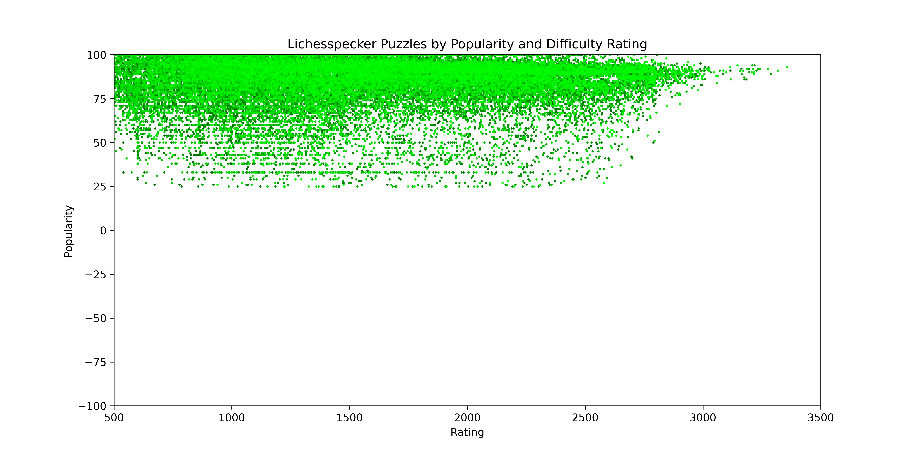

# Lichesspecker
The "Woodpecker Method" is a chess study technique popularized by Axel Smith in his book *The Woodpecker Method*.
The method involves the repeated exposure to the same set of chess puzzles, using spaced-repetition, to help players develop pattern recognition and tactical awareness.
In his book, he provides a set of approximately 1,000 chess puzzles which the user works through as a set in repeated cycles.
The first cycle takes several months to complete, but with each subsequent cycle the time to solve all the puzzles decreases.

**Lichesspecker** is my take on the Woodpecker method using the free and open source puzzle database provided by [lichess.org](https://database.lichess.org/).
Unlike the original Woodpecker Method, Lichesspecker is a set of sixty themed decks each containing around 1,000 chess puzzles from across the rating spectrum.
In total, the Lichesspecker collection contains just under 60,000 themed chess puzzles.
On Lichess.org, puzzle popularity ranges from -100 to 100. 
Puzzles included in this collection have a minimum popularity of 25.
Additionally, the puzzles were selected using systematic sampling, so puzzle difficulty ranges from the trivial to the master level.

**Anki** is spaced-repetition flashcard software which lends itself naturally to the Woodpecker Method. 
The Lichesspecker collection is shared as an Anki deck. 
The cards use TowelSniffer's excellent [Anki-Chess-2.0](https://github.com/TowelSniffer/Anki-Chess-2.0) card template.

## How to Install

To install the Lichesspecker you must:

1. Download and install [Anki](https://apps.ankiweb.net/)
2. Download the desire .apkg file.
3. File > Import the .apkg file in Anki.

## How to Use

After importing the deck into Anki, you can either focus on a specific theme by choosing one of the sixy subdecks or you can use the top-level deck to do puzzles from the entire collection.
Be sure to check the options for the top-level deck to ensure that:

1. The number of new cards per day and number of reviews per day is kept to a reasonable number (I use 10 new cards a day with a maximum of 200 reviews). This will keep you from becoming overwhelmed by the sheer number of puzzles.
2. Under the Display Order option, set "New card gather order" to Random Cards. This will make sure you are being exposed to a variety of puzzle difficulties. Cards were put in the deck starting with the easiest and ending with the hardest. Accordingly, you can change how you are exposed to new puzzles by changing the "new card gather order" option.

## Future Plans

I would like to release additional versions of the "Lichesspecker" deck, specifically a condensed version that is more inline with the original Woodpecker Method, include raw PGN files with future releases, and create a basic python application that allows users to create decks according to their own requirements. This application would include features such as theme selection, rating ranges, popularity ranges, and the ability to choose how many cards you want per deck.
